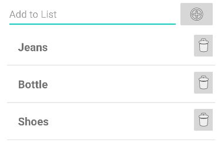

# Android Custom Adapter for ListView

To populate a ListView in Android you will have to add an Adapter, which will connect your data
from (e.g.) an ArrayList to the layout.\
If you want to add a specific design to every ListView-Item you will have to develop your own adapter and overwrite the getView().\
This is an example for a Custom Adapter for ListView in Android:

### Ressources
- [Main Ressource - Example for Custom Adapter](https://medium.com/mindorks/custom-array-adapters-made-easy-b6c4930560dd)
- [ListView in Android](https://www.tutorialspoint.com/how-to-make-a-listview-in-android)
- [Explanation of Adapters in Android](https://www.edureka.co/blog/what-are-adapters-in-android/)
- [How does the ArrayAdapter getView() method works?](https://stackoverflow.com/questions/6442054/how-does-arrayadapter-getview-method-works)
- [How to Add Custom Adapter for ListViw on Android?](https://www.tutorialspoint.com/how-to-add-custom-adapter-for-my-listview-on-android#)
